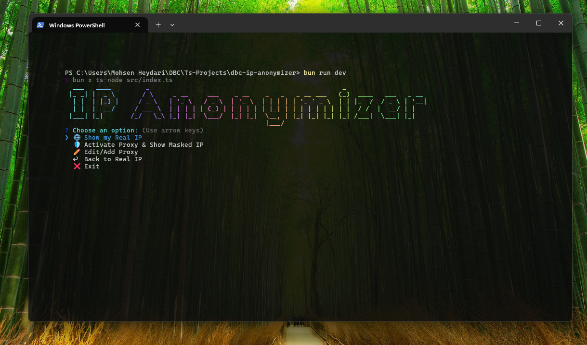

# IP Anonymizer Console App *
---

## Overview

IP Anonymizer is a **minimal and colorful console application** that allows you to:

- View your real IP
- Activate a Proxy to mask your IP
- Hash your IP for extra security
- Enjoy progress bars and animations for better UX
- Manage and edit Proxies interactively  
  The app is designed to keep a message "IP Masking is active..." whenever a Proxy is enabled.

---

## Features

- 🌐 Display your Real IP
- 🛡️ Activate Proxy & display Masked IP
- ✏️ Edit/Add Proxy quickly
- ↩️ Switch back to Real IP
- 🔒 Hash IP (SHA-256)
- ⏳ Animated Progress Bars for each task
- 🎨 Minimal and colorful design with icons

---

## Prerequisites

- Node.js >= 18
- bun
- (Optional) Xray/V2Ray client for using VLESS proxies

---

## Installation

1. Clone the repository:
   ```bash  
   git clone https://github.com/discoverbasecode/ip-anonymizer.git  
   cd ip-anonymizer  
   ```  

2. Install dependencies:
   ```bash  
   bun add  
   ```  

3. Run the application:
   ```bash  
   bun run dev  
   # or  
   bun x ts-node src/index.ts  
   ```  

---

## Usage

- After running, a menu will appear:

  **Options:**
    - 🌐 Show my Real IP
    - 🛡️ Activate Proxy & Show Masked IP
    - ✏️ Edit/Add Proxy
    - ↩️ Back to Real IP
    - ❌ Exit

- If no Proxy is set, the program automatically tests a built-in list of free Proxies.
- If no working Proxy is found, the program will ask you to add a new Proxy manually.

---

## Example

🌐 Show my Real IP

```
Fetching Real IP...
Real IP: 123.456.789.12
Hashed: 8f14e45fceea167a5a36dedd4bea2543
```

🛡️ Activate Proxy & Show Masked IP

```
Connecting via Proxy...
Proxy Active! 🚀
Masked IP: 98.76.54.32
Hashed: d2d2d2d2d2d2d2d2d2d2d2d2d2d2d2d2
App is running... Your IP is masked.
```

---

## Notes

- For VLESS usage, run Xray/V2Ray and set a local SOCKS Proxy at 127.0.0.1:1080.
- The console app uses this Proxy to mask your IP.
- Free Proxies may stop working quickly; you can always Edit/Add Proxy manually.

---

## License

MIT License © 2025
